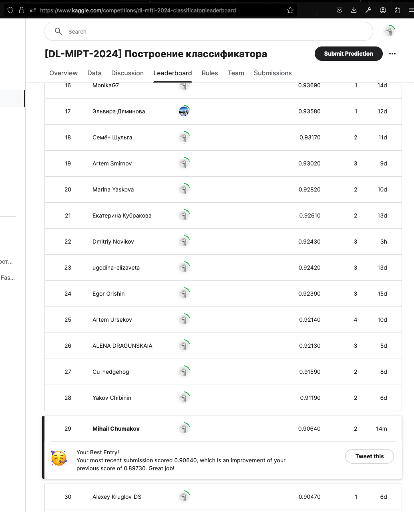

# Соревнование на Kaggle

**В рамках данного учебного соревнования вам предстоит построить модель, классифицирующую изображения с одеждой, 
которая построена на датасете Fashion-MNIST.** 

> Fashion-MNIST — аналог знаменитого датасета MNIST, 
> который состоит не из рукописных символов, а из предметов одежды. Он был создан, 
> чтобы актуализировать учебные задачи в компьютерном зрении и приблизить их к реальности.

Решение более сложной постановки этой задачи может использоваться, например, в маркетплейсах. 
Покупателю могут рекомендоваться товары по изображениям в соответствии с введенным описанием. 
Продавцу при загрузке изображений в карточку товара могут автоматически рекомендоваться теги и описание предмета одежды.

Каждое изображение представляет собой набор из 784 пикселей (`28x28`). 
Каждый пиксель принимает значение от 0 до 255, обозначая его цвет в черно-белой шкале. 
Обучающая выборка содержит 786 столбцов, 
где первый (`label`) — принадлежность изображения к классу, 
а последний — его уникальный номер (`id`). Остальные столбцы — пиксели изображения.

Задача будет считаться решенной, если в Public Leaderboard вы наберете score, который будет равен 0.80 или больше. 
В качестве метрики используется accuracy. В день вы можете отправлять не более 20 решений (это ограничения платформы). 
Помните, что решения принимаются только в том формате, который представлен в файле sample_submission.csv.

# Результат
